## Session 1 - Microsoft Azure & Visual Studio Team Services Overview in Developers prospective

**Table of Content**

1. Create an end-to-end DevOps Pipeline by using Azure DevOps Project
2. Create an end-to-end VSTS Project with VSTS DemoGenerator
3. Use Visual Studio Code (on Mac) to debug Asp.net Core (C#) Web Application
4. Use Visual Studio 2017 (on Windows) to debug the same code base
5. Create an Azure Function App and integrate with the Web Application
6. Use Application Insight to monitor and track telemetry data

**Hands-on Lab Instructions**

### Lab 01. Create an end-to-end DevOps Pipeline by using Azure DevOps Project & VSTS DemoGenerator

Go to https://azure.microsoft.com/en-us/features/devops-projects/ and click on **Try it Now**

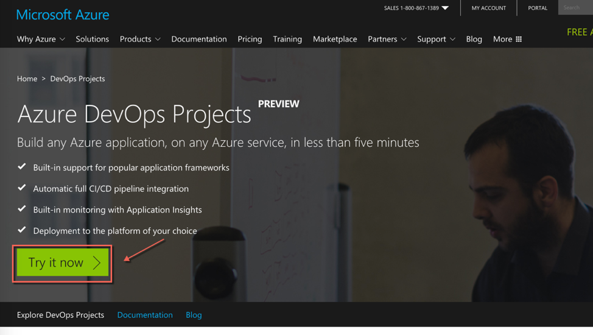

On **Runtime** page, choose **.NET**

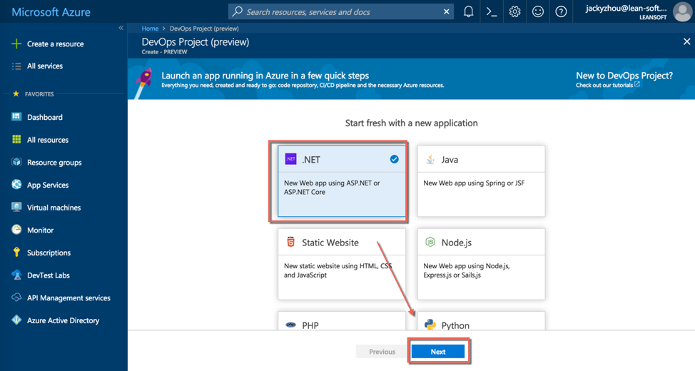

On **Framework** page, choose **ASP.NET Core**

On **Service** page, choose **Web App for Containers**

On **Create** page, Fill in the following information

| parameter | value                    | description                                          |
| --------- | ------------------------ | ---------------------------------------------------- |
| Account   | {your VSTS Account Name} | Choose Create Name or Using an existing VSTS account |
| Project   | {your Project name}      | Type in a new project name                           |

Click on **Create** button, this process will take up to 10 mins.

Navigate to your newly created DevOps Project, you will see everything you need for developing, deploying and monitoring your project in one single page.

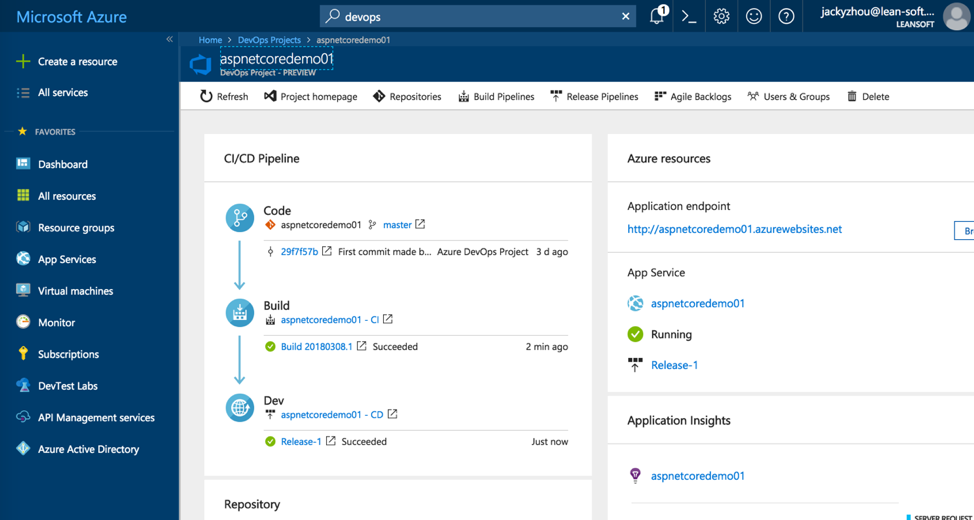

### Lab 02. Create an end-to-end VSTS Project with VSTS DemoGenerator

Please follow the instructions from https://almvm.devopshub.cn/labs/vsts/VSTSDemoGenerator/ to create a VSTS project with the following feature all configured and ready to learn.

1. Dashboard
2. Product Backlog & Sprint Backlog
3. Kanban
4. Test Plan & Test Cases
5. Continues Integration Build Definition
6. Continues Deployment Pipeline Release Definition

Here is a quick 3 steps guide for using **VSTS DemoGeneator**

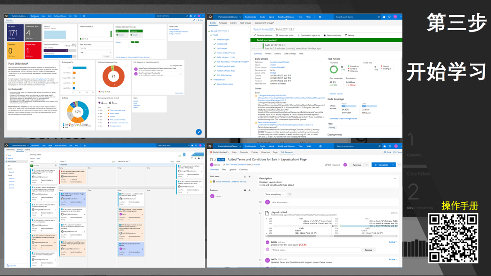

### Lab 03. Use Visual Studio Code (on Mac) to debug Asp.net Core (C#) Web Application

If you are running a MacBook like me, you will wondering if it's possible to work with the code that we just created by DevOps Project. Because we chose ASP.NET Core as our Framework, it's possible to use any platform as your development workstation to start coding, debugging and testing your application.

From the **DevOps Project Home** page, click on **Repositories** button on the top.

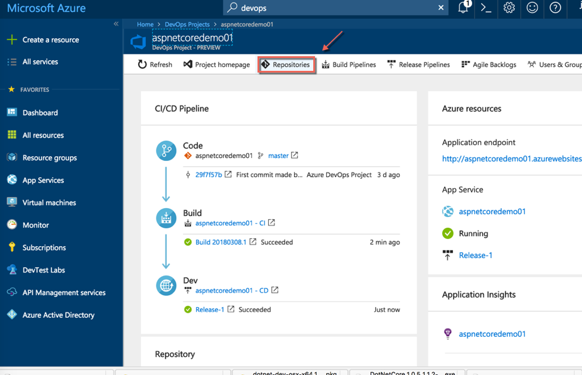

You will be navigated into the VSTS Project that is created for you and git repo is showing up

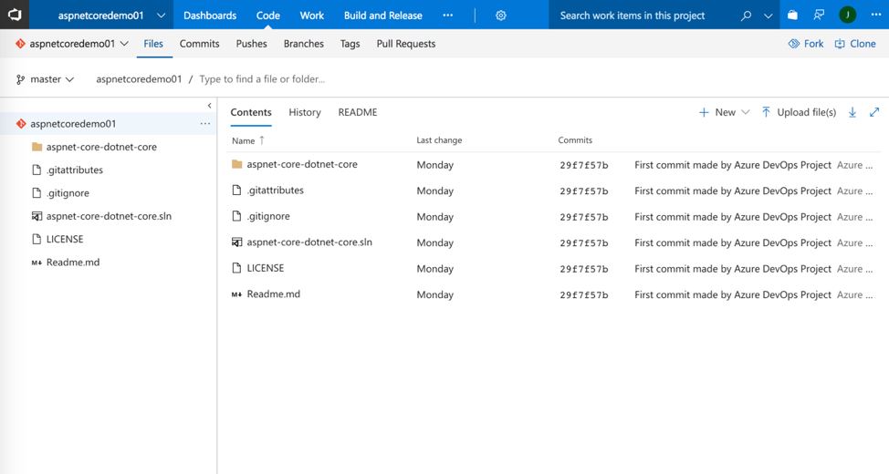

Now, you can get the **repo URL** and clone the code to your MacOS.

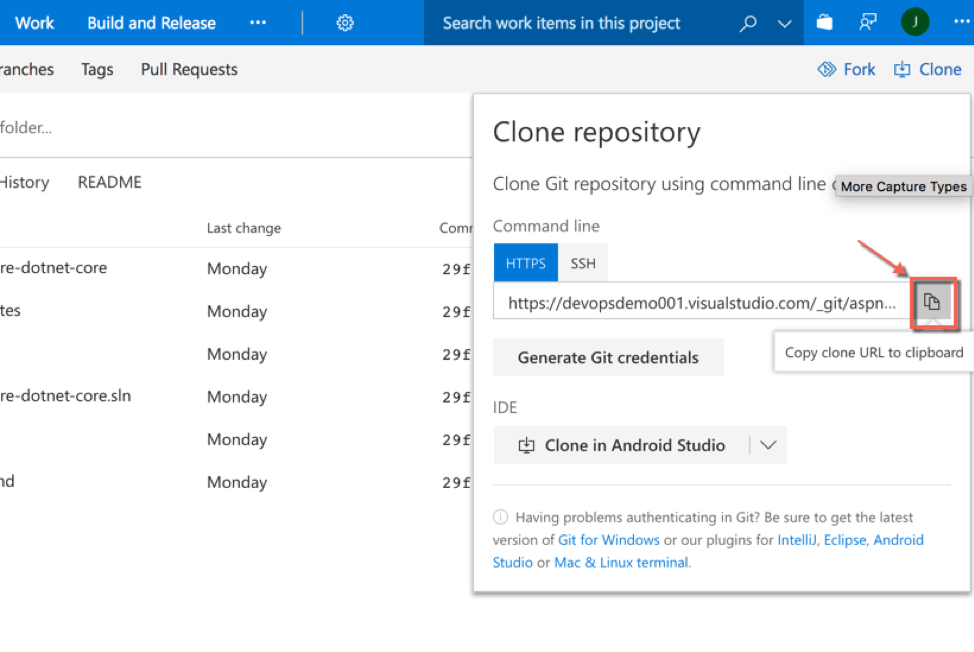

Use [Visual Studio Code](https://code.visualstudio.com/) open the git repo, vscode will start to install necessary tools and restore your dependencis.

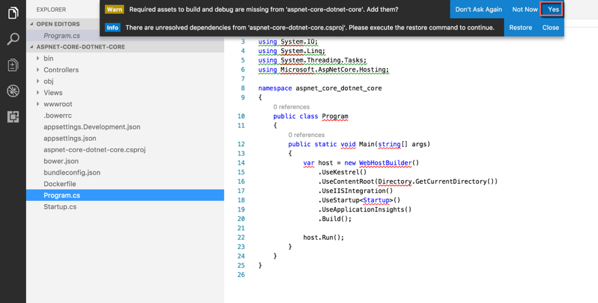

When the installation and restoring process finishes, you can navigate to the debug tab and click on the **start debugging** button.

The Application will run and show up in your browser like this

You can even setup a **break point** in your code and see vscode break into that point, then you can step into your code to view the varibles.

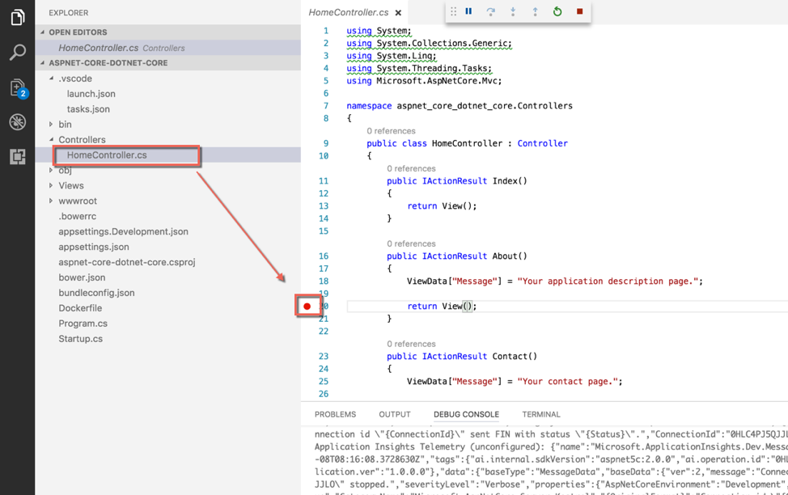

You can also make changes to your code and push the code up to VSTS, then the CI/CD process will be triggered and eventually the Web App in Azure is updated automatically. 

This could happen because Azure DevOps Project has setup the whole pipeline for you so you don't have to worry about configure the CI/CD and write any scripts.

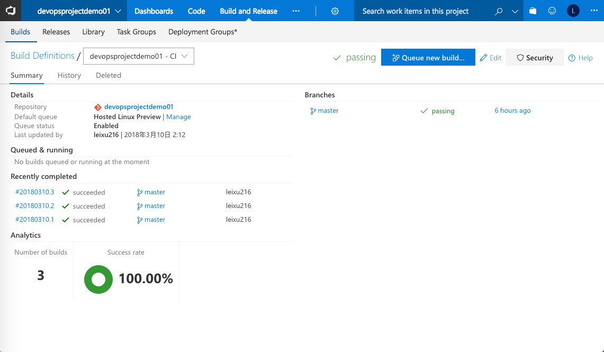

If you remember that we chose **Web App with Container** when we setup this Azure DevOps Project, you should know that there are **Azure Container Registry** behind the sense to support our CI/CD pipeline, you can navigate to this ACR to see the container images that we have been built and pushed.

### Lab04. Use Visual Studio 2017 (on Windows) to debug the same code base

As mentioned before, ASP.NET Core is cross platform. You can use a Windows Machine with Visual Studio installed to open the same code base that we have modified on MacOS and debug the code without any changes.

From the VSTS git repo and choose **Clone** on the top right, you will see a list of supported IDEs; choose Visual Studio and Visual Studio will pop up and start cloneing the code.

This operation will setup your Visual Studio to connect to the VSTS Project and make the code ready for developing.

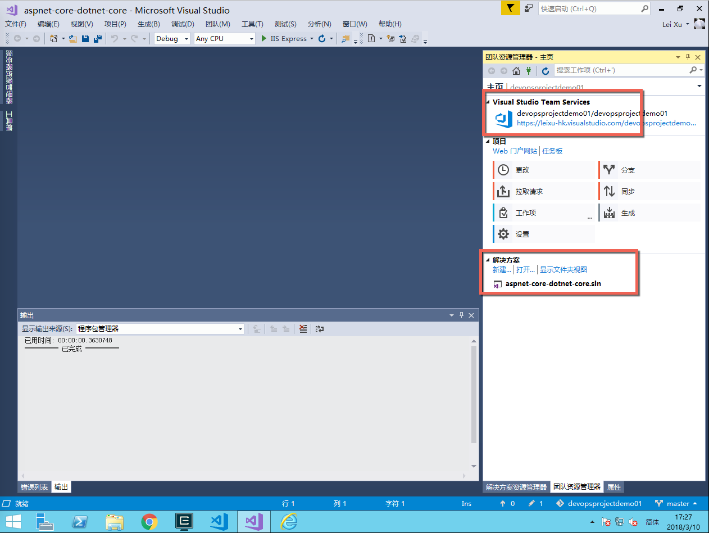

Press **F5** and now you are debugging the same code that we have been using from MacOS just a while ago.

### Lab05. Create an Azure Function App and integrate with the Web Application

Azure Function is **Serverless** architecture implmentation on Azure, we can create a **Function App** with just one file.

Create a **Function App** from Azure Portal

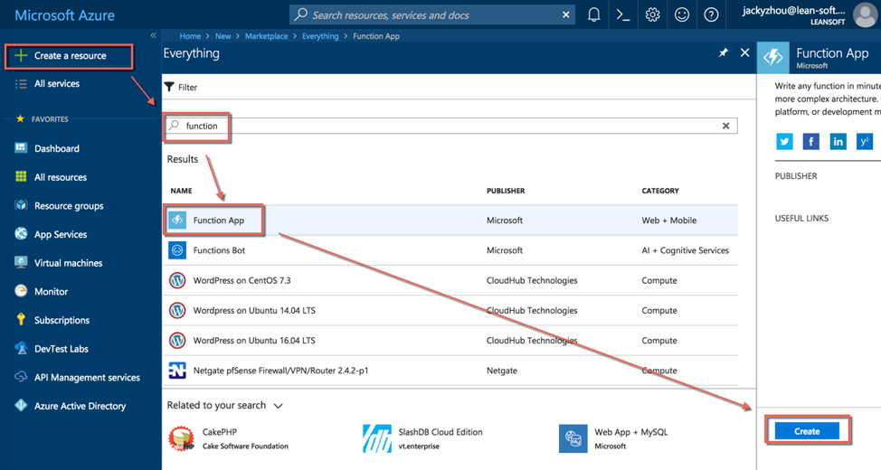

Fill up the following infomation and click create

|parameter   |value   |description   |
|---|---|---|
|App name   |name of the project   |   |
|Resource Group   |   |   |
|Hosting Plan   |   |   |
|Location   |   |   |

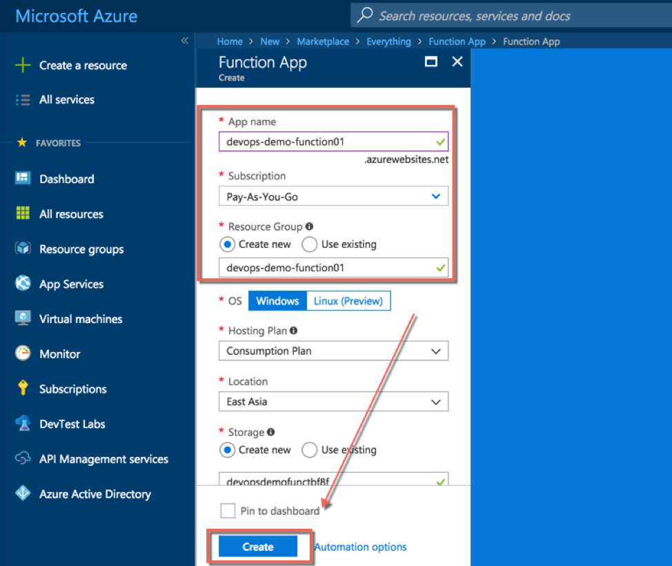

Use Visual Studio to create a **Azure Function** Project

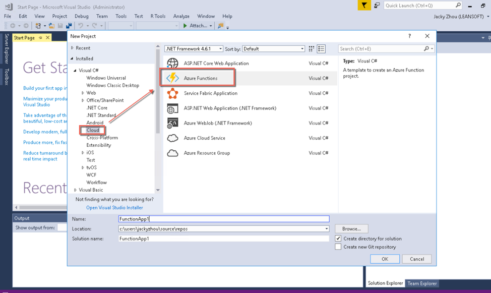

Right click the project node and create an new Item, Azure Function, name it **UserList.cs**

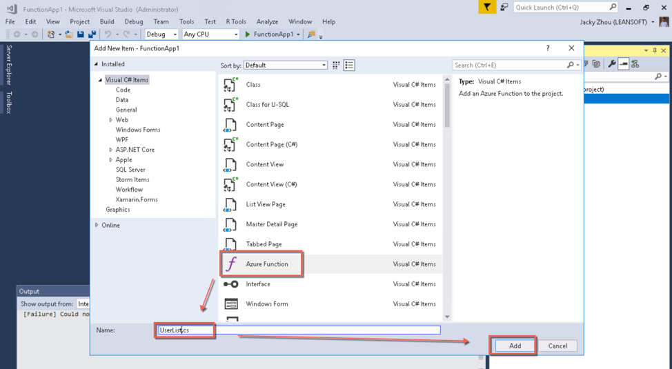

Choose **Http Trigger** for the function

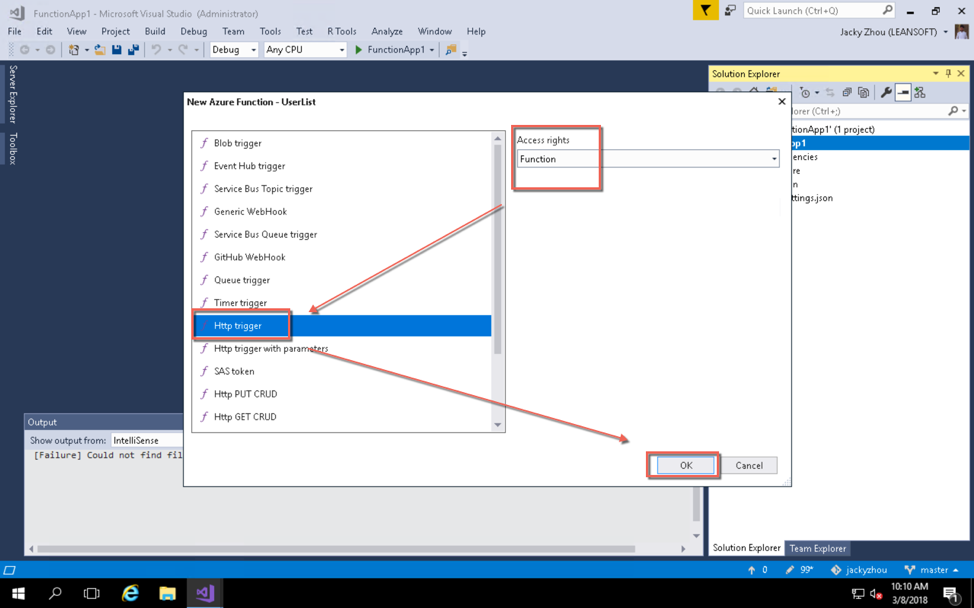

Use the following code to replace the function code file

- [UserList.cs](code/UserList.cs)

Right click the Project and choose Publish, then choose **Select Existing** for the service, and pick the Function App we just created in Azure Portal.

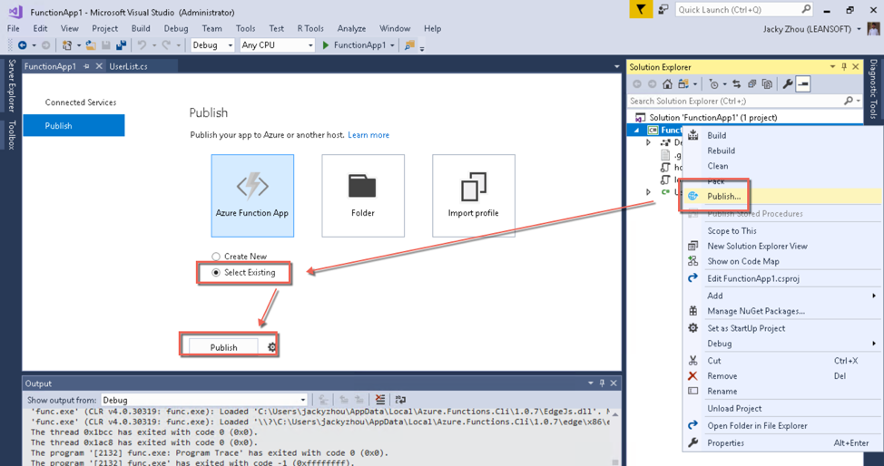

Wait for the publishing process to be finished.

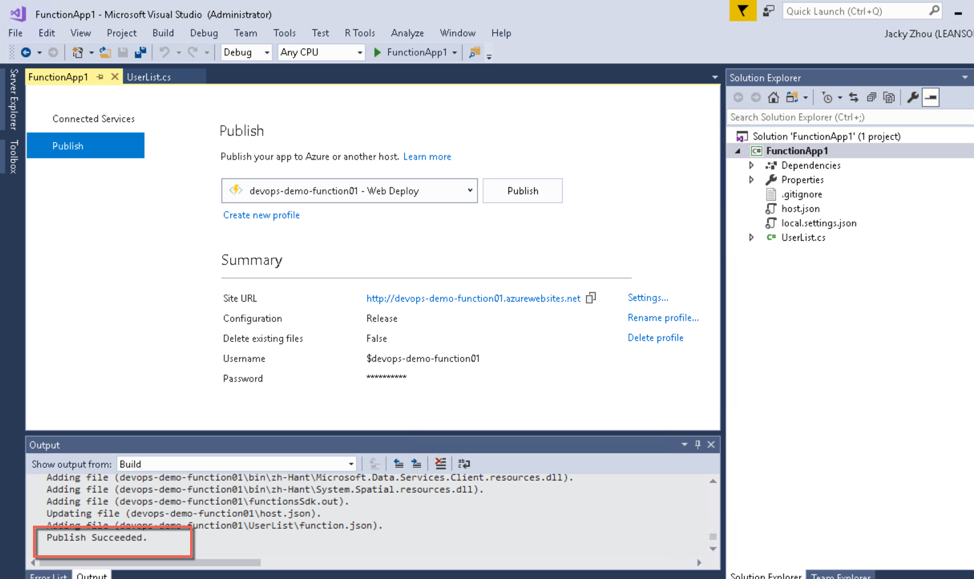

Go to Azure Portal, navigate to the Azure Function App and click on **Get Function Url**

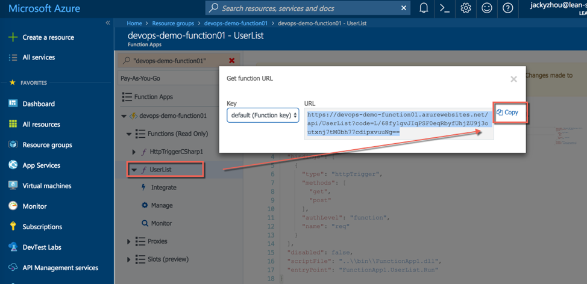

Copy & Paste the Url into a browser windows, you will see we have a Api Service ready for use

Now, Let's try to integrate this Azure Function with our DevOps Project Demo code, use the following files to replace correspodnent code file

- [HomeController.cs](code/HomeController.cs)
- [index.cshtml](code/index.cshtml)

### Lab06. Use Application Insight to monitor and track telemetry data

Finally, let's close the DevOps Loop by examine the Application Insight Dashboard.

In the **DevOps Project Home** page, click on **Applciation Insight** link

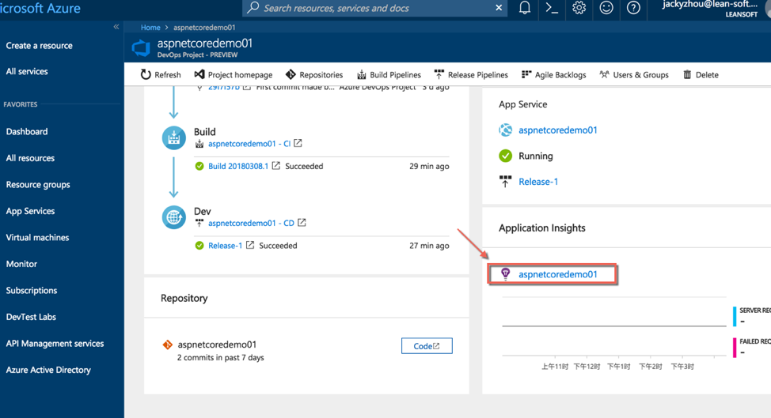

Then you can explore the **Application Insight** Dashboard

To be next time ...
