## Session 2: Deploying and Scaling Micro services with Docker and Kubernetes on Azure

Focus on the new Azure Kubernetes Service (AKS), dive into the details of build, ship and run a Microservices architecture application using Visual Studio, VSTS and AKS. Starting from coding in a Docker for Windows enabled VM as the development workstation backed by DevTest Lab, then we will commit the code into a VSTS git repo and build up the release pipeline to deliver into a AKS cluster environment. Finally, we will run a rolling update triggered by VSTS release pipeline on AKS to show the capabilities of container based cluster.


Key take-away:

- Understanding of capabilities of containers, docker and Kubernetes and how to take advantage of these technologies in daily work
- In depth knowledge of Azure Kubernetes Services (AKS) and how to manage such service in Microsoft Azure

**Table of Content**

1. Create a Azure DevTestLabs VM & Install Docker for Windows
2. Config & Test your Docker for Windows Development Environment
3. Code, Build, Debug & Test Docker Containers on Azure DevTestLabs VMs
4. Setting up Azure Container Registry (ACR) and push images
5. Setting up Azure Kubernetes Services (AKS) Cluster
6. Deploy & Scale Application on AKS
7. CI/CD with Visual Studio Team Services

**Hands-on Lab Instructions**

### Lab 01. Create a Azure DevTestLabs VM & Install Docker for Windows

In Azure Portal, click on **All Services | Search for Dev **


Click on **Add**, give it a name and enable **Auto Shutdown**, recommended region for Chinese Developers is **Southeast Asia (Singapore)** because there are more VM SKUs then the East Asia (Hongkong), we need **Dv3 or Ev3** for running **Nested Virutalization** on the VM to install **Docker for Windows** later.

**Auto Shutdown** will help to save your Azure Credit because you don't really need this machine to be running when you are sleeping.


Wait about 3 mins you will see the Dashboard for your Lab. In My Labs section, there are many useful feature to support a Dev Team

- **My virtual machines**: shows machines owned by yourself.
- **Claimable virtual machines**: you can create a couple of SDE (Standard Development Environment) machines for your team according to the SDKs and projects and place them here for team member to share.
- **My data disks**: for you to create shared disks that can be attached to different machines so you don't worry about move your data around. 
- **Formulas**: some scripts for you to install sofewares on these machines automatically
- **My secrets**: save database username, connection string, production password etc. here so you don't have to remember them.


Click on Add button and search for Visual Studio 2017, choose Visual Studio 2017 Enterprise on Windows 10 (latest release), and use E2S_v3 (2core, 16G Ram) SKU.

We need Ev3 for **Nested Virtualization** support.


Wait until the VM is running and get the RDP file from Connect option

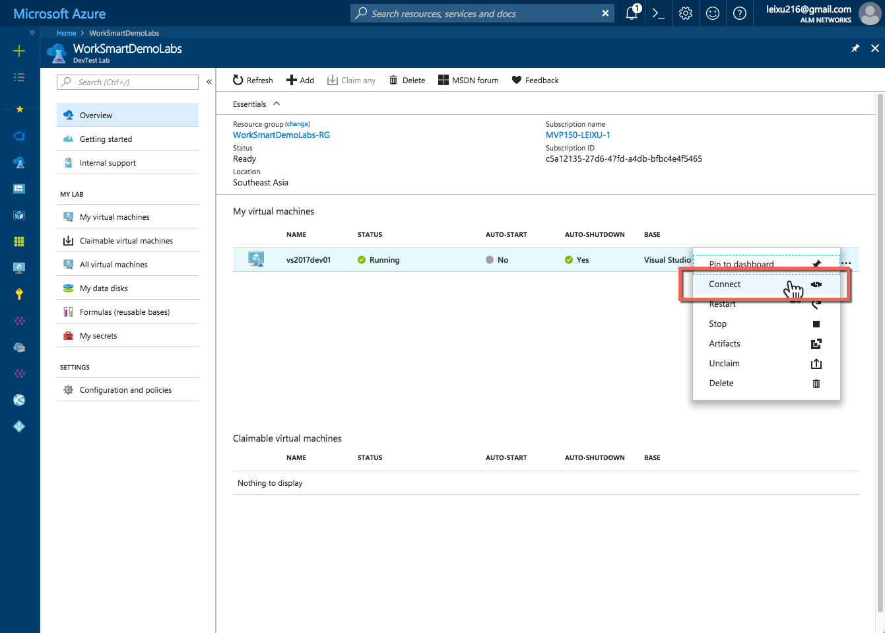

Enable Hyper-V and Containers support on the VM

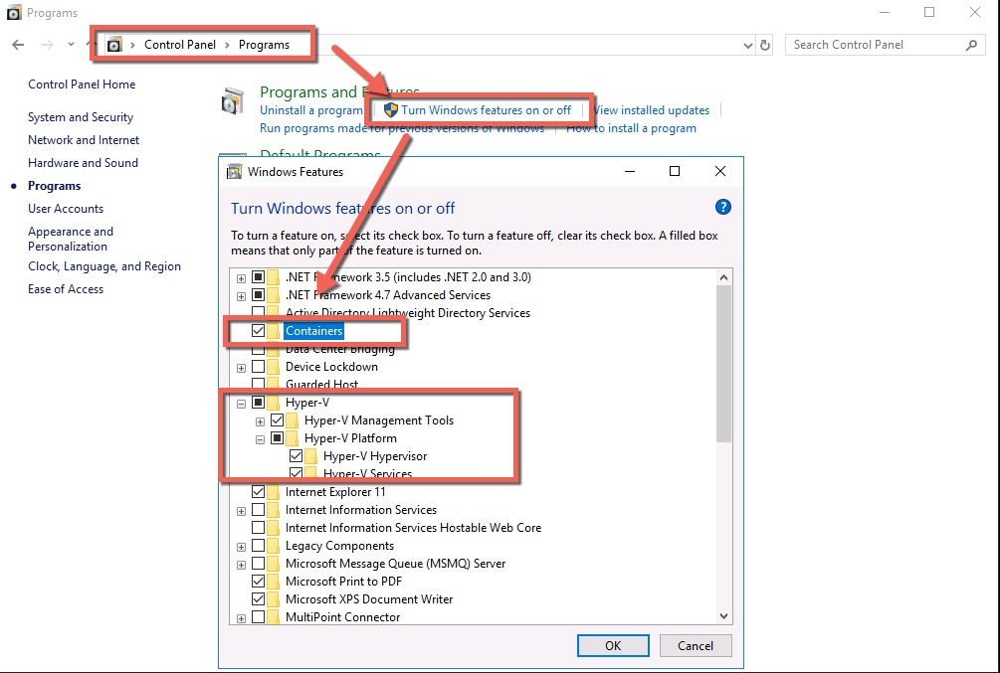

Install the following Softwares

- Visual Studio Code (stable channel) https://code.visualstudio.com/
- Git for Windows https://git-scm.com/
- Azure CLI 2.0 https://docs.microsoft.com/en-us/cli/azure/install-azure-cli?view=azure-cli-latest 
- Docker for Windows (CE stable channel) https://store.docker.com/editions/community/docker-ce-desktop-windows
- Cmder (Full Installer) http://cmder.net

### Lab 02. Config & Test your Docker for Windows Development Machine

**Switch between Linux & Windows Containers**

Docker for Windows supports both Linux and Windows Containers, you can choose which one to use from he context menu.

> Note: make sure you are clear which one to use when you are working on your application.

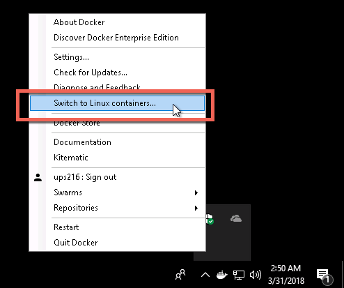

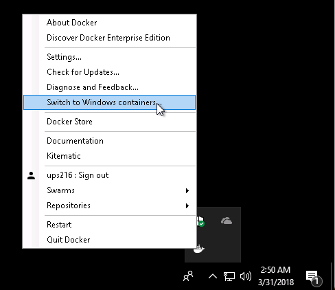

**Enable Shared Drives to use Docker Volume**

Make sure your tick all the dirves in Shared Drives configuration, this allows you to map a folder from your computer inside Docker Containers which is very useful when you are debugging your application.

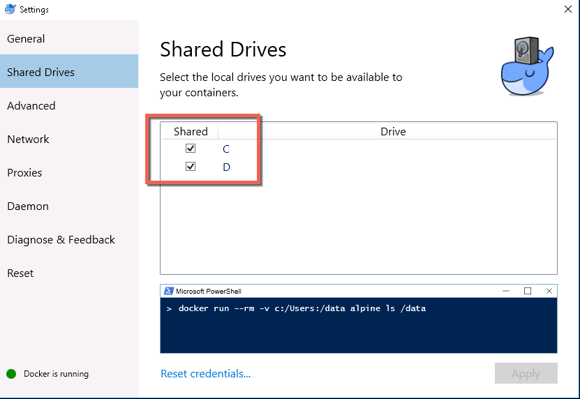

**Increase the memory usage for Docker Containers VM**

As we have 16G Ram for the VM, it's ok for allocate more memory for the Docker Container VM. This will allow you to run your application faster.

> Note: Docker for Windows in Linux mode will use a MobyLinux VM running in Hyper-V to host a linux VM.

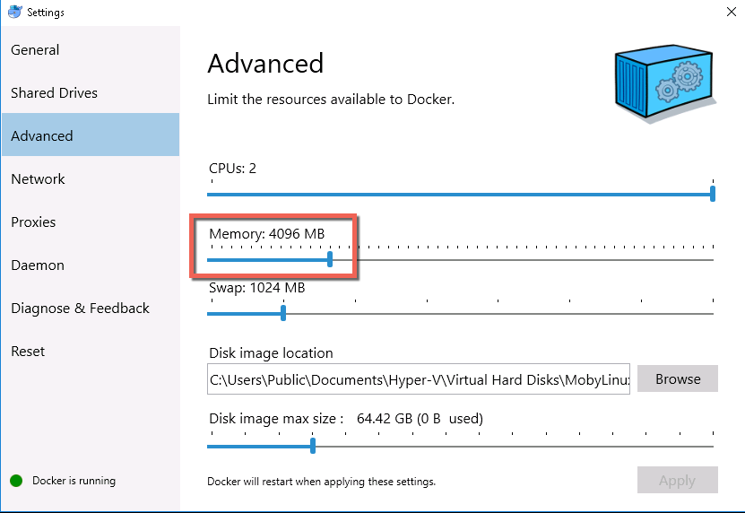

**Run your first Docker Containers**

Linux Containers

Switch to Linux Containers and run the following command (using Cmder).

```bash
docker run hello-world
```

If you see something like this, your Docker for Windows (Linux Cotnainer mode) is working correctly.

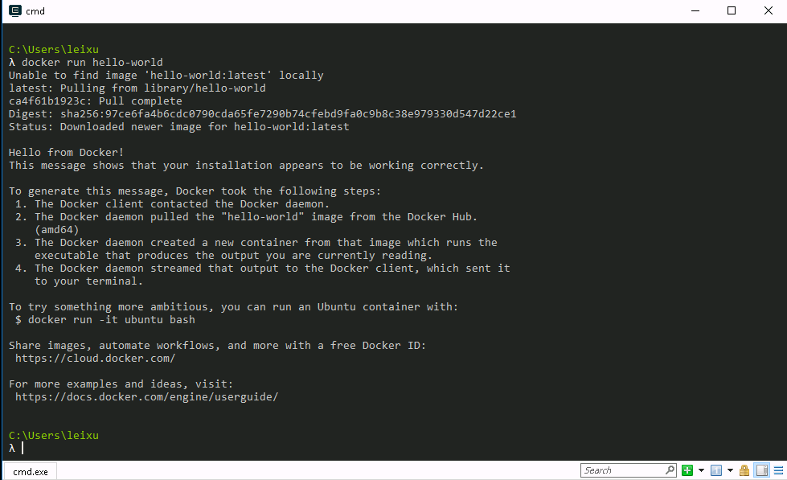

Windows Containers

Switch to Windows Containers and run the following command (using Cmder).

```Powershell
docker run -it microsoft/nanoserver cmd
```


This will pull a container image microsoft/nanoserver and run cmd inside it, then you can run the following command inside the Windows Container.

```PowerShell
powershell.exe Add-Content C:\HelloWorld.ps1 'Write-Host "Hello World from Windows Container"'
exit
```


Basically, we have create a HelloWorld.ps1 script inside this nanoserver container, now let's save this container as our own HelloWorld container image.

```bash
docker ps -a
```

This command will list all running and stopped container, you need to write down the {container id} and put into the next command

```bash
docker commit {continer id} helloworld
```

Basiclly, we have created a new Docker Container Image with our HelloWorld.ps1 in there.


Now, we can run our Windows Hello World Container.

```bash
docker run helloworld poweshell.exe c:\HelloWorld.ps1
```


Now, our Azure DevTestLabs VM is ready for containerized application development.

### Lab 03 - Code, Build, Debug & Test Docker Containers on Azure DevTestLabs VMs

> Note: The following steps are using Linux Containers.

**Debug a Asp.Net Core WebApp in Visual Studio and Docker for Windows**

Create a new **ASP.NET Core Web Application** in VS 2017, name the application **aspnet-core-docker-linux**
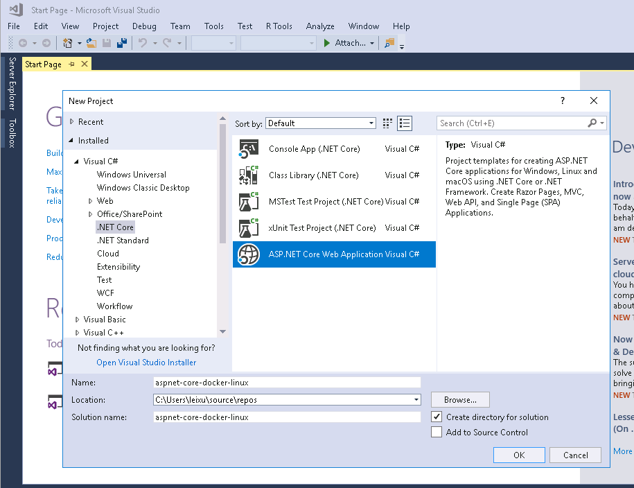

Choose **Web Application (MVC)** and Enable **Docker Support with OS = Linux**
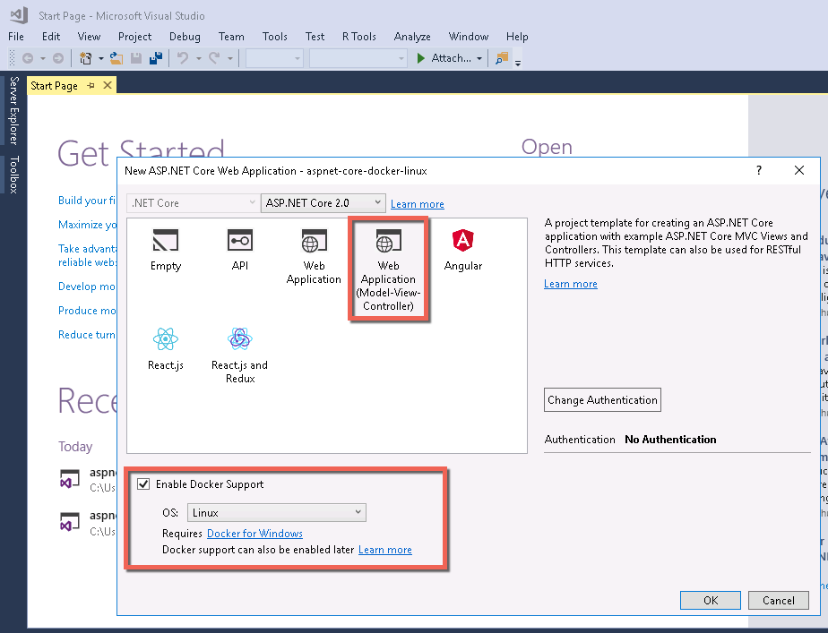

Visual Studio will start pulling down base image for .net core 2.0, wait until the Output window says "Done! Docker containers are ready"
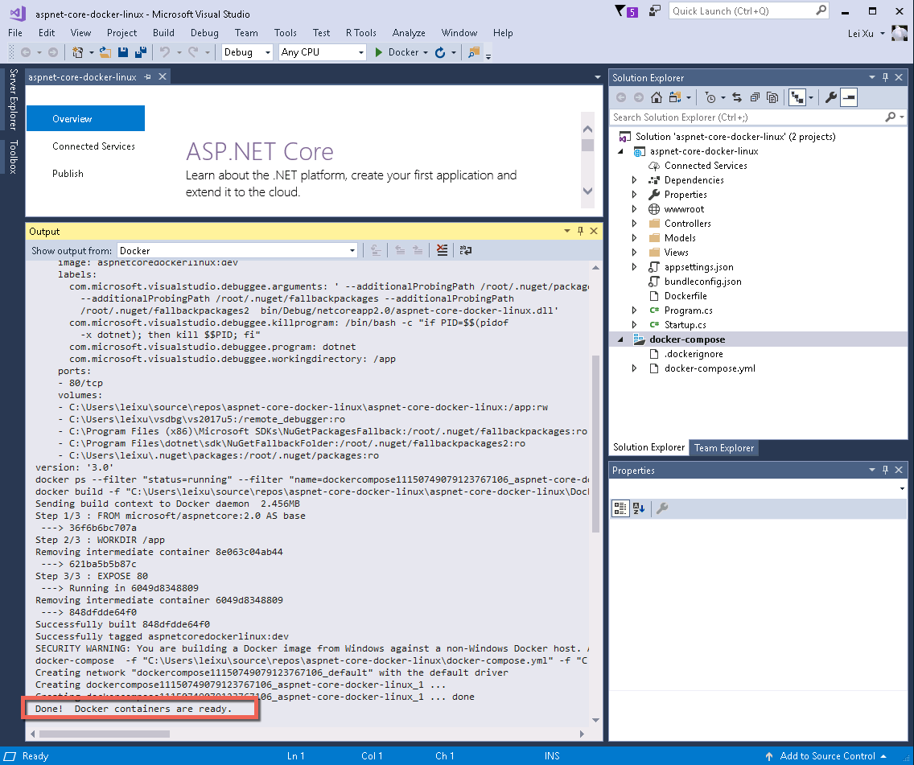

Open a cmder windows and check the images

```bash
docker images
```


Press F5 to start debugging on the application, set a breakpoint in HomeController line 20 and trigger the breakpoint, you can see VS break into that line of code and you can debug the application line by line.

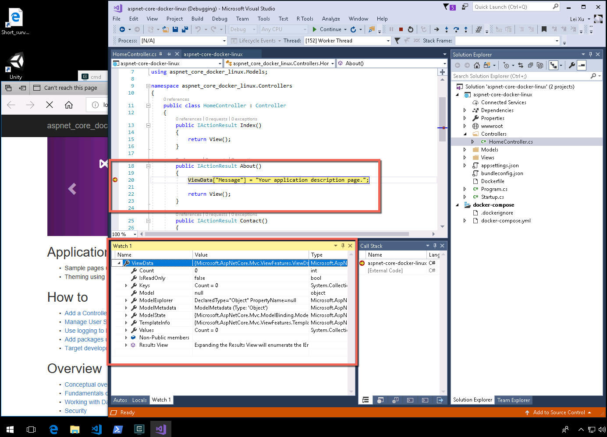

Open a cmder window and build the image manually, make sure your at the root of the solution folder

```bash
λ docker build -f aspnet-core-docker-linux\Dockerfile -t aspnetcore-dockerlinux:v1 .
Sending build context to Docker daemon  2.464MB
Step 1/17 : FROM microsoft/aspnetcore:2.0 AS base
 ---> 36f6b6bc707a
Step 2/17 : WORKDIR /app
 ---> Using cache
 ---> 621ba5b5b87c
Step 3/17 : EXPOSE 80
 ---> Using cache
 ---> 848dfdde64f0
Step 4/17 : FROM microsoft/aspnetcore-build:2.0 AS build
2.0: Pulling from microsoft/aspnetcore-build
c73ab1c6897b: Already exists
1ab373b3deae: Pull complete
b542772b4177: Pull complete
57c8de432dbe: Pull complete
bed105aa3587: Pull complete
eb64200f0658: Pull complete
ba13e5b31f5d: Pull complete
e7a5cf0d2182: Pull complete
7e90a4db81b5: Pull complete
ddf742436635: Pull complete
Digest: sha256:618d25f23747bd42d7fe023e539b4559094cc9f7bba96954580fa6625c6b028f
Status: Downloaded newer image for microsoft/aspnetcore-build:2.0
 ---> 244f6193d21a
Step 5/17 : WORKDIR /src
Removing intermediate container a3210866743d
 ---> ffc29050a193
Step 6/17 : COPY aspnet-core-docker-linux.sln ./
 ---> 2c0d1d306612
Step 7/17 : COPY aspnet-core-docker-linux/aspnet-core-docker-linux.csproj aspnet-core-docker-linux/
 ---> bb71abd20ba0
Step 8/17 : RUN dotnet restore -nowarn:msb3202,nu1503
 ---> Running in 485fa047b4a4
  Restoring packages for /src/aspnet-core-docker-linux/aspnet-core-docker-linux.csproj...
  Generating MSBuild file /src/aspnet-core-docker-linux/obj/aspnet-core-docker-linux.csproj.nuget.g.props.
  Generating MSBuild file /src/aspnet-core-docker-linux/obj/aspnet-core-docker-linux.csproj.nuget.g.targets.
  Restore completed in 1.66 sec for /src/aspnet-core-docker-linux/aspnet-core-docker-linux.csproj.
  Restoring packages for /src/aspnet-core-docker-linux/aspnet-core-docker-linux.csproj...
  Restore completed in 401.29 ms for /src/aspnet-core-docker-linux/aspnet-core-docker-linux.csproj.
Removing intermediate container 485fa047b4a4
 ---> dbb56e818ed0
Step 9/17 : COPY . .
 ---> df84eb1cc611
Step 10/17 : WORKDIR /src/aspnet-core-docker-linux
Removing intermediate container 9c4fead38ed8
 ---> 8bfce91a92aa
Step 11/17 : RUN dotnet build -c Release -o /app
 ---> Running in a0baa175e5da
Microsoft (R) Build Engine version 15.6.82.30579 for .NET Core
Copyright (C) Microsoft Corporation. All rights reserved.

  Restore completed in 111.34 ms for /src/aspnet-core-docker-linux/aspnet-core-docker-linux.csproj.
  Restore completed in 33.97 ms for /src/aspnet-core-docker-linux/aspnet-core-docker-linux.csproj.
  aspnet-core-docker-linux -> /app/aspnet-core-docker-linux.dll

Build succeeded.
    0 Warning(s)
    0 Error(s)

Time Elapsed 00:00:22.49
Removing intermediate container a0baa175e5da
 ---> c88ff446f4c4
Step 12/17 : FROM build AS publish
 ---> c88ff446f4c4
Step 13/17 : RUN dotnet publish -c Release -o /app
 ---> Running in b8621f5cd080
Microsoft (R) Build Engine version 15.6.82.30579 for .NET Core
Copyright (C) Microsoft Corporation. All rights reserved.

  Restore completed in 151.55 ms for /src/aspnet-core-docker-linux/aspnet-core-docker-linux.csproj.
  Restore completed in 33.63 ms for /src/aspnet-core-docker-linux/aspnet-core-docker-linux.csproj.
  aspnet-core-docker-linux -> /src/aspnet-core-docker-linux/bin/Release/netcoreapp2.0/aspnet-core-docker-linux.dll
  aspnet-core-docker-linux -> /app/
Removing intermediate container b8621f5cd080
 ---> 1c4f6606e1ce
Step 14/17 : FROM base AS final
 ---> 848dfdde64f0
Step 15/17 : WORKDIR /app
Removing intermediate container d9f1e17fac53
 ---> a6b8b3daa8ef
Step 16/17 : COPY --from=publish /app .
 ---> e35f106148bd
Step 17/17 : ENTRYPOINT ["dotnet", "aspnet-core-docker-linux.dll"]
 ---> Running in fbcde3ef25a1
Removing intermediate container fbcde3ef25a1
 ---> 2642d04c7785
Successfully built 2642d04c7785
Successfully tagged aspnetcore-dockerlinux:v1
SECURITY WARNING: You are building a Docker image from Windows against a non-Windows Docker host. All files and directories added to build context will have '-rwxr-xr-x' permissions. It is recommended to double check and reset permissions for sensitive files and directories.

C:\Users\leixu\source\repos\aspnet-core-docker-linux
```

Now, we can check the images again.

```bash
C:\Users\leixu\source\repos\aspnet-core-docker-linux
λ docker images
REPOSITORY                   TAG                 IMAGE ID            CREATED             SIZE
aspnetcore-dockerlinux       v1                  2642d04c7785        5 minutes ago       327MB
<none>                       <none>              1c4f6606e1ce        5 minutes ago       1.97GB
aspnetcoredockerlinux        dev                 848dfdde64f0        19 minutes ago      325MB
microsoft/aspnetcore-build   2.0                 244f6193d21a        7 days ago          1.96GB
microsoft/aspnetcore         2.0                 36f6b6bc707a        7 days ago          325MB
```

You can see there is aspnetcore-dockerlinux with TAG:v1 available for use. Run the following command to start this container on port 8080 and 8081

```bash
C:\Users\leixu\source\repos\aspnet-core-docker-linux
λ docker run -itd -p 8080:80 aspnetcore-dockerlinux:v1
b1befafcd580f225ae37888bff644d346f2035723862875d38c20675824fb59d

C:\Users\leixu\source\repos\aspnet-core-docker-linux
λ docker run -itd -p 8081:80 aspnetcore-dockerlinux:v1
99a4cee77ea7c5a173e0eb38c1935142d8309af90c009e860f46025b34e9ebe3
```

Open browser for both of the address, you can see we have 2 instances of the same application running on different port

- http://localhost:8080
- http://localhost:8081

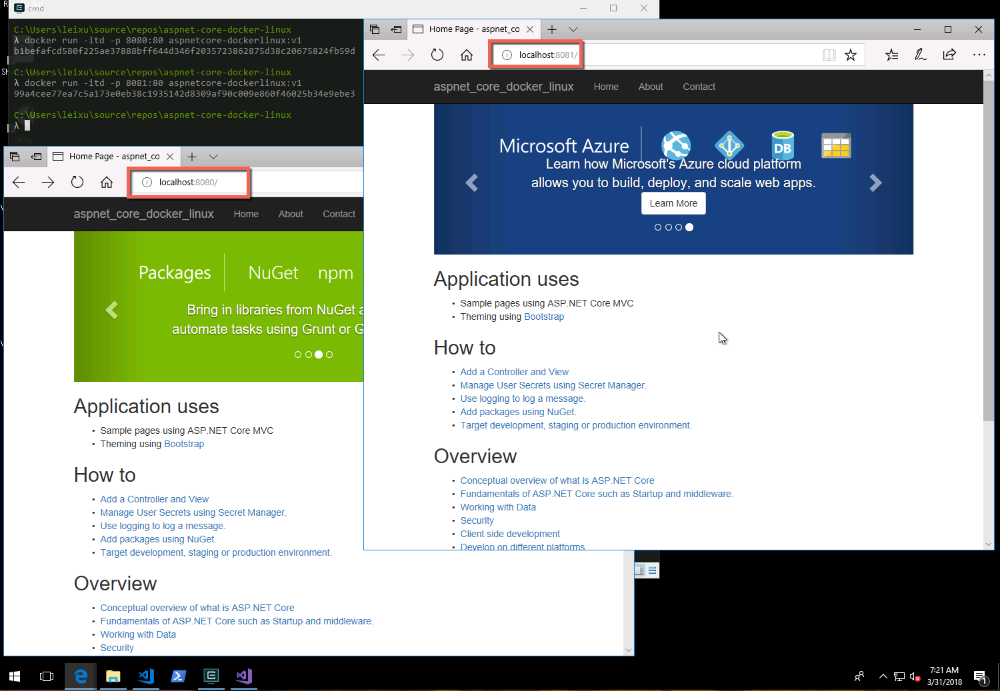

You can modify the application and run docker build again to build a v2; then run v2 on port 8082.

```bash
docker build -f aspnet-core-docker-linux\Dockerfile -t aspnetcore-dockerlinux:v2 .
docker run -itd 8082:80 aspnetcore-dockerlinux:v2
```
Now, we have 3 instances of 2 version of the application running on the same machine on 3 different ports.
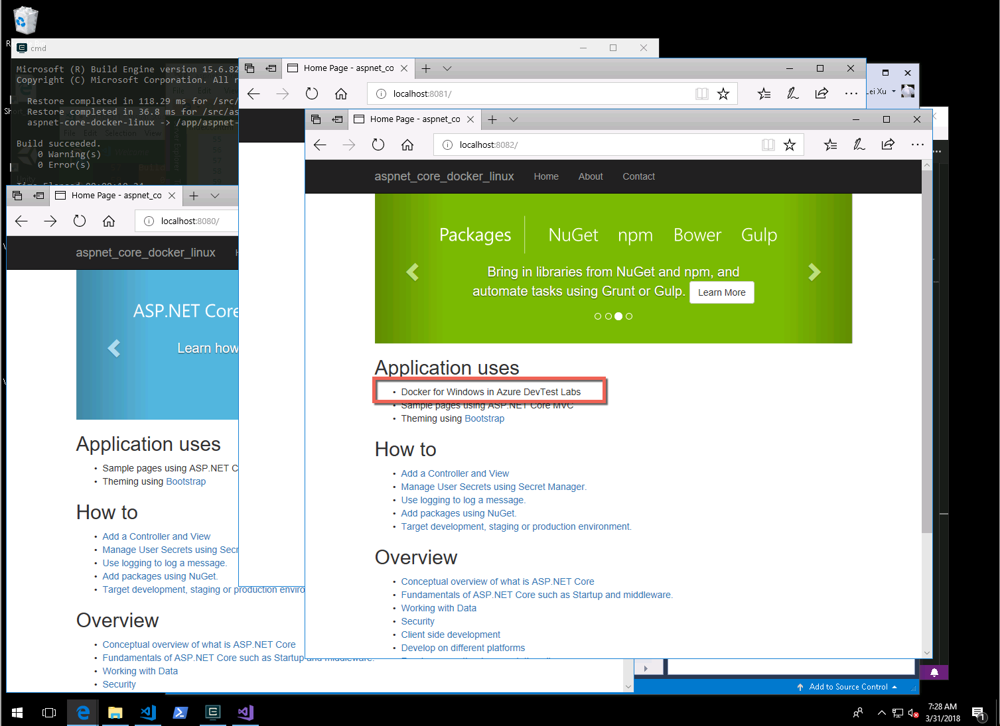

**Run a multi-container micro-services application**

Get the sample from Github https://github.com/lean-soft/voting-azure-devops.git

```bash
git clone https://github.com/lean-soft/voting-azure-devops.git
cd voting-azure-devops
code .
docker-compose up
```

> Note: command **code .** will open the application folder in Visual Studo Code for later debugging.

Wait a while until you see the cmder window starting showing logs from the containers (with db, result_1, worker_1 as prefix), then your application is up and running, you can open a browser to open the following address:

- Voting Page http://localhost:5000
- Result Page http://localhost:5001

> Note: The first time running linux container on a Windows Machine will trigger a confirmation from Windows Firewall, just click **Allow access**.

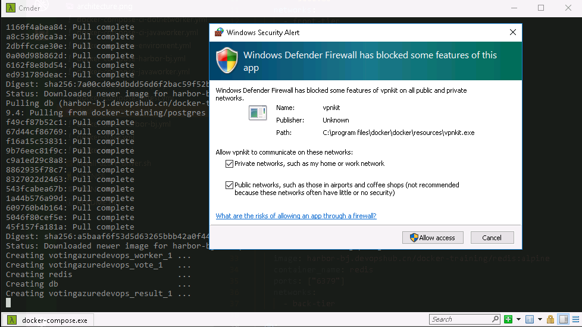

You can see the voting and result pages are showing up and linux containers are running inside the cmder window.

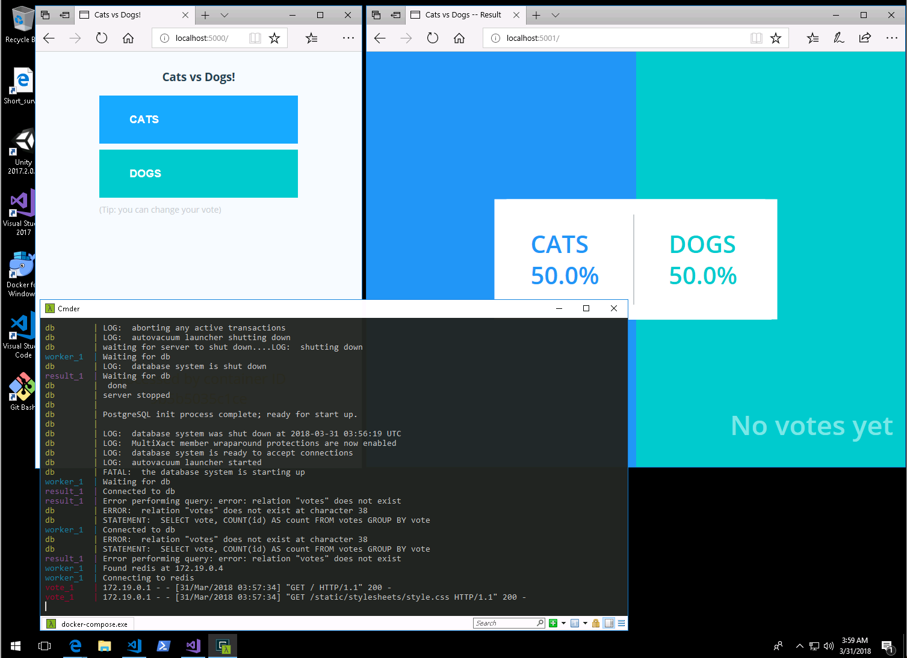

Refer to the architecture of this applicatiob below to understand how easy it is to use docker to run a multiple container micro services system on a single machine, which is impossible without docker.


TIP: use the following command to quickly clean up your running and stopped containers. It's very easy to leave a lot of containers running so it's good idea to clean them up from time to time. 

```bash
FOR /f "tokens=*" %i IN ('docker ps -a -q') DO docker stop %i
FOR /f "tokens=*" %i IN ('docker ps -a -q') DO docker rm %i
```

### Lab 04 - Setting up Azure Container Registry (ACR)

Container Registry is used to manage docker images as artifact store, as docker containers are tagged with version, container registry will become the version control for images.

Create ACR

```bash
## Login from command line
az login

## Set the default subscription
az account set --subscription "{subscription id}"

## Create resource group
az group create --name myResourceGroup --location eastus

## Create ACR  (replace <acrname> with your own name)
az acr create --resource-group myResourceGroup --name <acrName> --sku Basic
```

Get ACR username and password and docker login into it

```bash
## Get ACR username and password and write it down
##  (replace <acrname> with your own name)
az acr update --name <acrName> --admin-enabled true
az acr credential show --name <acrName>

## Use username and password from above to login
## (replace <acrname> with your own name)
docker login <acrname>.azurecr.io
Login Succeed
```

Tag the images we have created above and push into the ACR

```bash
## Tag the images (replace <acrname> with your own name)
docker tag aspnetcore-dockerlinux:v1 <acrname>.azurecr.io/linux/aspnetcore-dockerlinux:v1
docker tag aspnetcore-dockerlinux:v2 <acrname>.azurecr.io/linux/aspnetcore-dockerlinux:v2

## Push the images (replace <acrname> with your own name)
docker push <acrname>.azurecr.io/linux/aspnetcore-dockerlinux:v1
docker push <acrname>.azurecr.io/linux/aspnetcore-dockerlinux:v2
```

Now you can check the images on Azure Portal, goto **Resource Group | myResouceGroup | {acrName} | Repositories**, you can see v1 and v2 are there


Do the following and publish container images for voting-azure-devops repo

```bash
cd voting-azure-devops

## Build images
docker-compose build

## Tag images (replace <acrname> with your own name)
docker tag votingazuredevops_vote <acrname>.azurecr.io/linux/vote
docker tag votingazuredevops_result <acrname>.azurecr.io/linux/result
docker tag votingazuredevops_worker <acrname>.azurecr.io/linux/worker

## Push images (replace <acrname> with your own name)
docker push <acrname>.azurecr.io/linux/vote
docker push <acrname>.azurecr.io/linux/result
docker push <acrname>.azurecr.io/linux/worker
```

Check **Resource Group | myResouceGroup | {acrName} | Repositories** again.

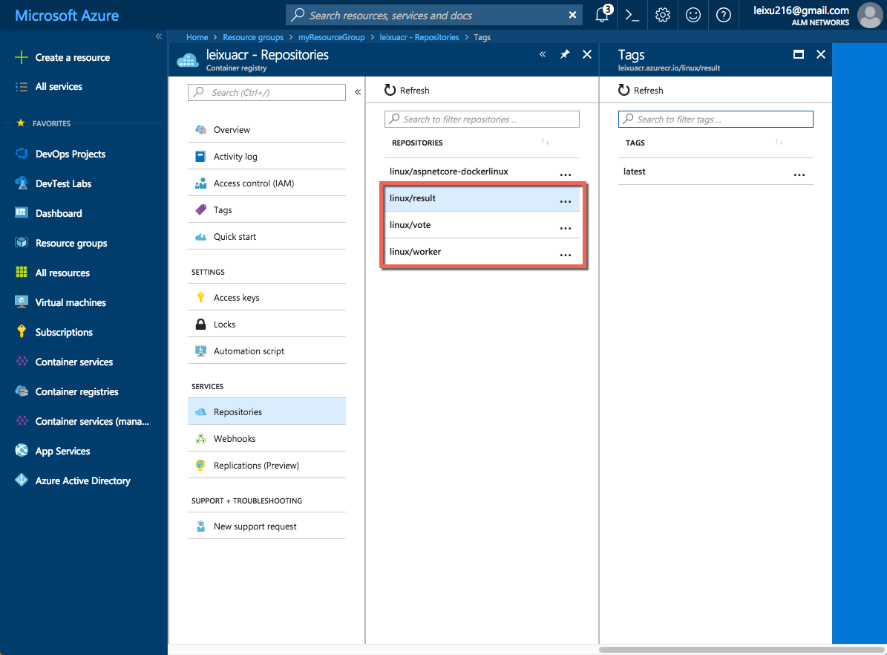

Now, we have our images ready for deploy into AKS.

### Lab05 - Setting up Azure Kubernetes Services (AKS) Cluster

Make sure you have run the ACR steps to have your azure-cli login successfully already.

```bash
## Register Azure service providers because AKS is still in preview
az provider register -n Microsoft.Network
az provider register -n Microsoft.Storage
az provider register -n Microsoft.Compute
az provider register -n Microsoft.ContainerService
```

Create AKS cluster with 1 agent

```bash
## Create AKS
az aks create --resource-group myResourceGroup --name myAKSCluster --node-count 1 --generate-ssh-keys
SSH key files 'C:\Users\leixu\.ssh\id_rsa' and 'C:\Users\leixu\.ssh\id_rsa.pub' have been generated under ~/.ssh to allow SSH access to the VM. If using machines without permanent storage like Azure Cloud Shell without an attached file share, back up your keys to a safe location
{
  "additionalProperties": {},
  "agentPoolProfiles": [
    {
      "additionalProperties": {},
      "count": 1,
      "dnsPrefix": null,
      "fqdn": null,
      "name": "nodepool1",
      "osDiskSizeGb": null,
      "osType": "Linux",
      "ports": null,
      "storageProfile": "ManagedDisks",
      "vmSize": "Standard_DS1_v2",
      "vnetSubnetId": null
    }
  ],
  "dnsPrefix": "myAKSClust-myResourceGroup-c5a121",
  "fqdn": "myaksclust-myresourcegroup-c5a121-32a2a33c.hcp.eastus.azmk8s.io",
  "id": "/subscriptions/c5a12135-27d6-47fd-a4db-bfbc4e4f5465/resourcegroups/myResourceGroup/providers/Microsoft.ContainerService/managedClusters/myAKSCluster",
  "kubernetesVersion": "1.7.9",
  "linuxProfile": {
    "additionalProperties": {},
    "adminUsername": "azureuser",
    "ssh": {
      "additionalProperties": {},
      "publicKeys": [
        {
          "additionalProperties": {},
          "keyData": "{removed for security protection}"
        }
      ]
    }
  },
  "location": "eastus",
  "name": "myAKSCluster",
  "provisioningState": "Succeeded",
  "resourceGroup": "myResourceGroup",
  "servicePrincipalProfile": {
    "additionalProperties": {},
    "clientId": "558ec528-c7ba-4aba-96f5-076f148019c7",
    "keyVaultSecretRef": null,
    "secret": null
  },
  "tags": null,
  "type": "Microsoft.ContainerService/ManagedClusters"
}
```

Install kubectl and connect to the cluster, make sure you run cmder as administrator first

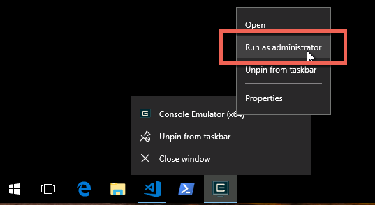

```bash
az aks install-cli
Downloading client to C:\Program Files (x86)\kubectl.exe from https://storage.googleapis.com/kubernetes-release/release/v1.10.0/bin/windows/amd64/kubectl.exe
Please ensure that C:\Program Files (x86) is in your search PATH, so the `kubectl.exe` command can be found.
```

Configure kubectl to connect to aks cluster

```bash
az aks get-credentials --resource-group myResourceGroup --name myAKSCluster
Merged "myAKSCluster" as current context in C:\Users\leixu\.kube\config

kubectl get nodes
NAME                       STATUS    ROLES     AGE       VERSION
aks-nodepool1-32127511-0   Ready     agent     22m       v1.7.9
```

### Labs 06 - Deploy & Scale Application on AKS

**Open Kubernetes Dashboard**

```bash
az aks browse --resource-group myResourceGroup --name myAKSCluster
Merged "myAKSCluster" as current context in C:\Users\leixu\AppData\Local\Temp\tmp9m8km6la
Proxy running on http://127.0.0.1:8001/
Press CTRL+C to close the tunnel...
Forwarding from 127.0.0.1:8001 -> 9090
Handling connection for 8001
Handling connection for 8001
Handling connection for 8001
Handling connection for 8001
Handling connection for 8001
```

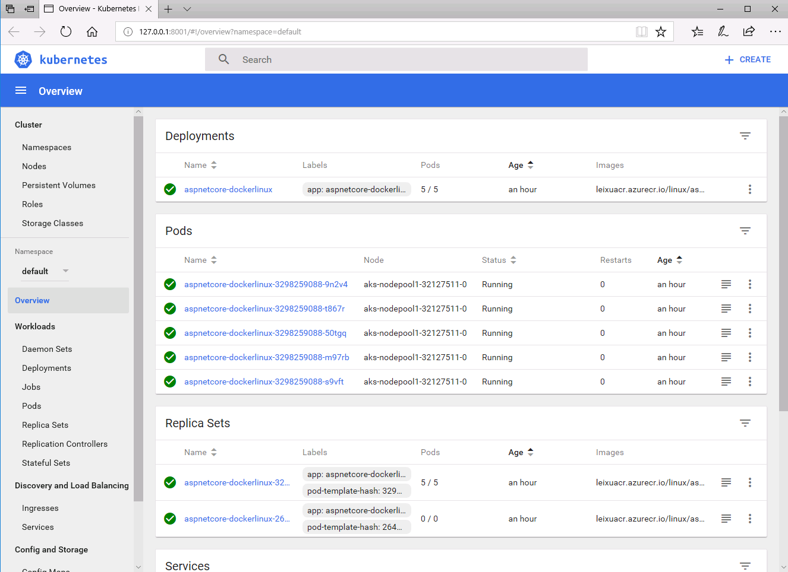

> Note: Press Ctrl-C to terminate the Dashboard session


**Create k8s secret**

As we have our image in a private ACR instance, we need to create K8s secret **regcred** to hold the ACR username and password in order to allow k8s to pull images from our ACR instance.

```bash
## Create the secret (replace <acrname> <acr-pwd> and <email>)
kubectl create secret docker-registry regcred --docker-server=<acrname>.azurecr.io --docker-username=<acrname> --docker-password=<acr-pwd> --docker-email=<your-email>

## Inspect the secret
kubectl get secret regcred --output=yaml
apiVersion: v1
data:
  .dockerconfigjson:
  {removed for security protection}
kind: Secret
metadata:
  creationTimestamp: 2018-03-31T09:36:56Z
  name: regcred
  namespace: default
  resourceVersion: "3200"
  selfLink: /api/v1/namespaces/default/secrets/regcred
  uid: {removed for security protection}
type: kubernetes.io/dockerconfigjson

## Use the following command to convert the dockerconfigjson to readable format
kubectl get secret regcred --output="jsonpath={.data.\.dockerconfigjson}" | base64 -d
```

**Create the deployment for aspnetcore-dockerlinux:v1**

Create the following **kube-deploy.yaml** file for deployment of our aspnetcore-dockerlinux:v1 application.

> Note: we are referring to the secret by imagePullSecrets configuration.

```yaml
apiVersion: apps/v1beta1
kind: Deployment
metadata:
  name: aspnetcore-dockerlinux
spec:
  replicas: 1
  template:
    metadata:
      labels:
        app: aspnetcore-dockerlinux
    spec:
      containers:
      - name: aspnetcore-dockerlinux
        image: <acrname>.azurecr.io/linux/aspnetcore-dockerlinux:v1
        ports:
        - containerPort: 80
      imagePullSecrets:
      - name: regcred
---
apiVersion: v1
kind: Service
metadata:
  name: aspnetcore-dockerlinux
spec:
  type: LoadBalancer
  ports:
  - port: 80
  selector:
    app: aspnetcore-dockerlinux
```

Run the following command to deploy aspnetcore-dockerlinux:v1 to AKS and get the external IP address of the service.

> Note: it will take some time for the 2nd line of service status to be showing up, --watch will keep updating the terminal until this is shown.

```bash
## Deploy to k8s
kubectl create -f kube-deploy.yaml
deployment "aspnetcore-dockerlinux" created
service "aspnetcore-dockerlinux" created

## Get pods status
kubectl get pods
NAME                                      READY     STATUS    RESTARTS   AGE
aspnetcore-dockerlinux-2644745569-hs59j   1/1       Running   0          44s

## Get service external IP
kubectl get service aspnetcore-dockerlinux --watch
NAME                     TYPE           CLUSTER-IP     EXTERNAL-IP   PORT(S)        AGE
aspnetcore-dockerlinux   LoadBalancer   10.0.127.169   <pending>     80:30830/TCP   51s
aspnetcore-dockerlinux   LoadBalancer   10.0.127.169   52.170.119.4   80:30830/TCP   2m
```

Now you can open the webapp from browser using the EXTERNAL-IP field

http://{EXTERNAL-IP}

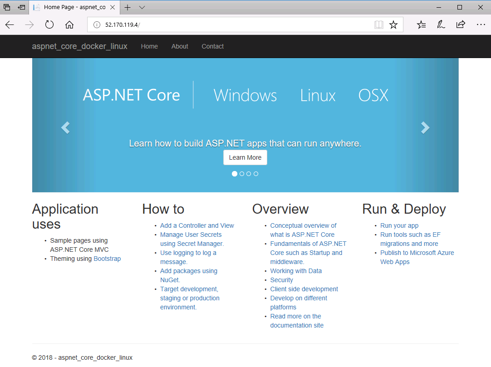

**Scale the application aspnetcore-dockerlinux:v1**

```bash
kubectl scale --replicas=5 deployment/aspnetcore-dockerlinux
deployment "aspnetcore-dockerlinux" scaled

kubectl get pods
NAME                                      READY     STATUS    RESTARTS   AGE
aspnetcore-dockerlinux-2644745569-4l10j   1/1       Running   0          16s
aspnetcore-dockerlinux-2644745569-6d2vk   1/1       Running   0          16s
aspnetcore-dockerlinux-2644745569-d8k8w   1/1       Running   0          16s
aspnetcore-dockerlinux-2644745569-hs59j   1/1       Running   0          13m
aspnetcore-dockerlinux-2644745569-nd3r5   1/1       Running   0          16s
```

**Update the deployment to aspnetcore-dockerlinux:v2**

```bash
## Send update command to k8s
kubectl set image deployment aspnetcore-dockerlinux aspnetcore-dockerlinux=leixuacr.azurecr.io/linux/aspnetcore-dockerlinux:v2
deployment "aspnetcore-dockerlinux" image updated

## Check the pods (during updating process)
kubectl get pods
NAME                                      READY     STATUS              RESTARTS   AGE
aspnetcore-dockerlinux-2644745569-4l10j   1/1       Running             0          4m
aspnetcore-dockerlinux-2644745569-6d2vk   1/1       Running             0          4m
aspnetcore-dockerlinux-2644745569-hs59j   1/1       Running             0          17m
aspnetcore-dockerlinux-2644745569-nd3r5   1/1       Terminating         0          4m
aspnetcore-dockerlinux-3298259088-4c99b   0/1       ContainerCreating   0          15s
aspnetcore-dockerlinux-3298259088-89cpb   0/1       ContainerCreating   0          15s
aspnetcore-dockerlinux-3298259088-c0pzg   1/1       Running             0          15s
aspnetcore-dockerlinux-3298259088-kbqvz   0/1       ContainerCreating   0          8s

## Check the pods (update is done)
kubectl get pods
NAME                                      READY     STATUS    RESTARTS   AGE
aspnetcore-dockerlinux-3298259088-4c99b   1/1       Running   0          47s
aspnetcore-dockerlinux-3298259088-5tw13   1/1       Running   0          39s
aspnetcore-dockerlinux-3298259088-89cpb   1/1       Running   0          47s
aspnetcore-dockerlinux-3298259088-c0pzg   1/1       Running   0          47s
aspnetcore-dockerlinux-3298259088-kbqvz   1/1       Running   0          40s
```

Now you can open the webapp v2 from browser using the EXTERNAL-IP field

http://{EXTERNAL-IP}

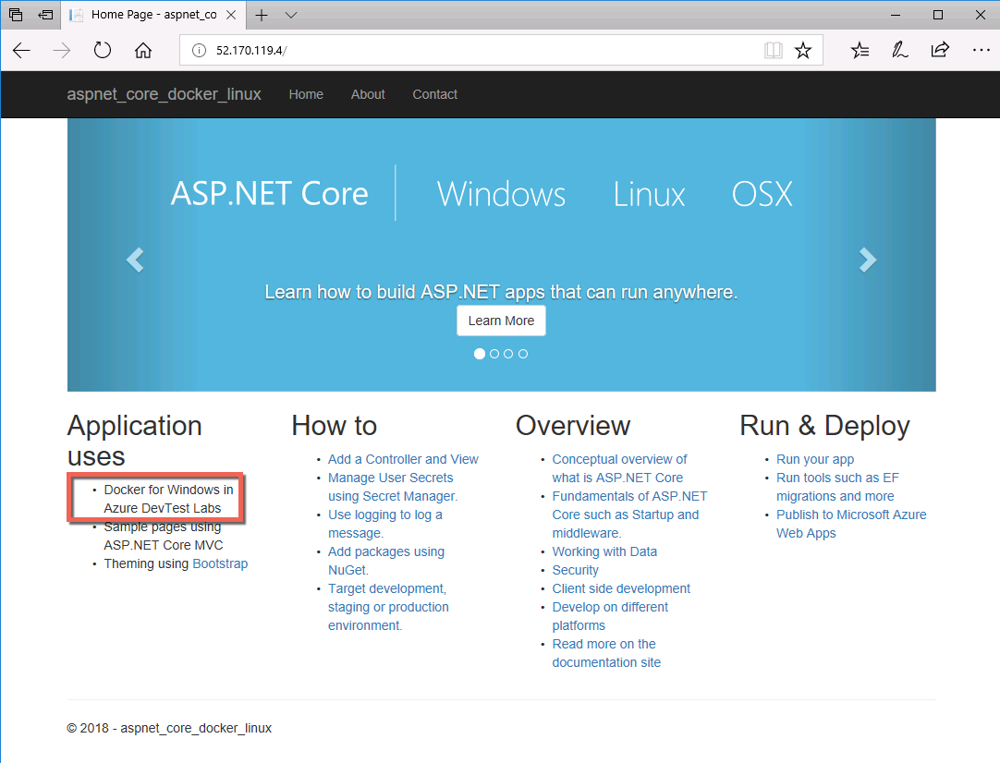

**Deploy voting-azure-devops to AKS**

Open voting-azure-devops/kompose folder and update all <acrname> to be yours in the following files

- vote-deployment.yaml
- result-deployment.yaml
- worker-deployment.yaml

Then you can use the following command to deploy to AKS

```bash
cd voting-azure-devops/kompose
kubectl create -f .
```

> Note: I'm using komepose to convert the docker-stack.yml to generate these yaml files for k8s, you can refer to the following link for more details
> http://kompose.io/

After the deployment, watch the K8s Dashboard and wait the vote and result services are showing up public IPs, then open them in browser to test.

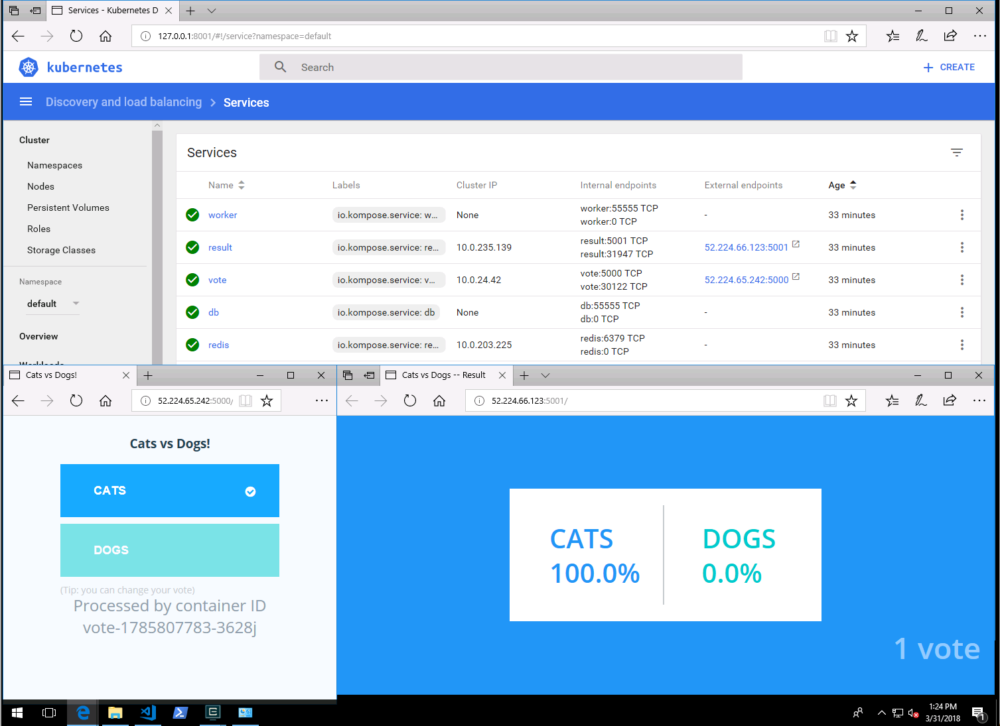

**Scale the agent nodes in AKS**

As we have deployed both aspnetcore-dockerlinux and voting-azure-devops applications to AKS, it make sense to scale the cluster in order to spread out the work load.

```bash
## Sacle AKS cluster to use 3 agents nodes
az aks scale --resource-group=myResourceGroup --name=myAKSCluster --node-count 3

## Scale the voting-azure-devops app to use 10 voting nodes
kubectl scale --replicas=10 deployment/vote
```
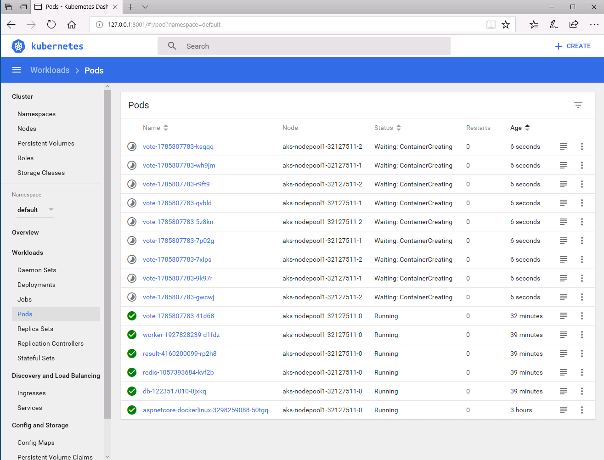

### Labs 07 - CI/CD with Visual Studio Team Services

**Import Sample Code**

Create a new VSTS Project and push voting-azure-devops repo into the project

```bash
cd voting-azure-devops
git remote add vsts {vsts-repo-url}
git push -u vsts master
```

**Add Service Endpoint for ACR**

```bash
## Get ACR loginServer
az acr list --resource-group myResourceGroup
[
  {
    "adminUserEnabled": true,
    "creationDate": "2018-03-31T07:50:47.164637+00:00",
    "id": "/subscriptions/c5a12135-27d6-47fd-a4db-bfbc4e4f5465/resourceGroups/myResourceGroup/providers/Microsoft.ContainerRegistry/registries/leixuacr",
    "location": "eastus",
    "loginServer": "<acrName>.azurecr.io",
    "name": "leixuacr",
    "provisioningState": "Succeeded",
    "resourceGroup": "myResourceGroup",
    "sku": {
      "name": "Basic",
      "tier": "Basic"
    },
    "status": null,
    "storageAccount": null,
    "tags": {},
    "type": "Microsoft.ContainerRegistry/registries"
  }
]

## Get ACR username and password
az acr credential show --name <acrName>
{
  "passwords": [
    {
      "name": "password",
      "value": "{acr-password}"
    },
    {
      "name": "password2",
      "value": "{acr-password}"
    }
  ],
  "username": "leixuacr"
}
```


**Add Service Endpoint for AKS**

Get the AKS API Server Address


Use the following command to get the kubeconfig file content

```bash
cat c:\Users\leixu\.kube\config
```

Copy these information and put into the following form

> Note: add https:// before the API Server Address

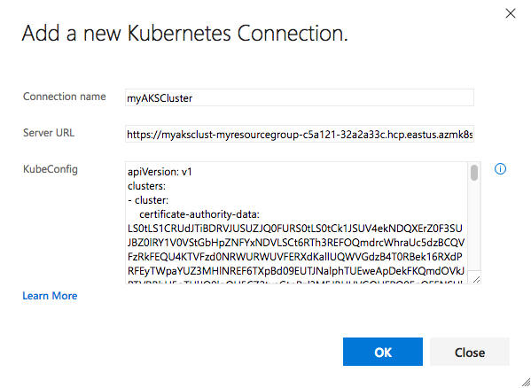

**Create a Build Definition to build vote, reuslt and worker images and push to ACR**

For each of the image, use Docker Build an Image and Docker Push and Image tasks, set the following parameters

- Docker Registry Connection: use the ACR endpoint
- Action: Build an Image
- Docker file: choose the application's Dockerfile from related folder
- Image Name: <acrName>.azurecr.io/linux/<service-name>: $(Build.BuildId)


- Docker Registry Connection: use the ACR endpoint
- Action: Push an Image
- Image Name: <acrName>.azurecr.io/linux/<service-name>: $(Build.BuildId)


> Note: $(Build.BuildId) will be generated and replaced by VSTS as the Build sequence id, this is used for docker image tags as our versioning control.

**Create a Release Defiition to update vote, result and worker images to AKS**

Add 1 environment for the Release Definition, add kubectl task and set the following parameters

- Kubernetes Service Connection: use the Kubernetes service endpoint
- Command: set
- Arguments: image deployment vote vote=leixuacr.azurecr.io/linux/vote:$(Release.Artifacts.voting-CI.BuildId)

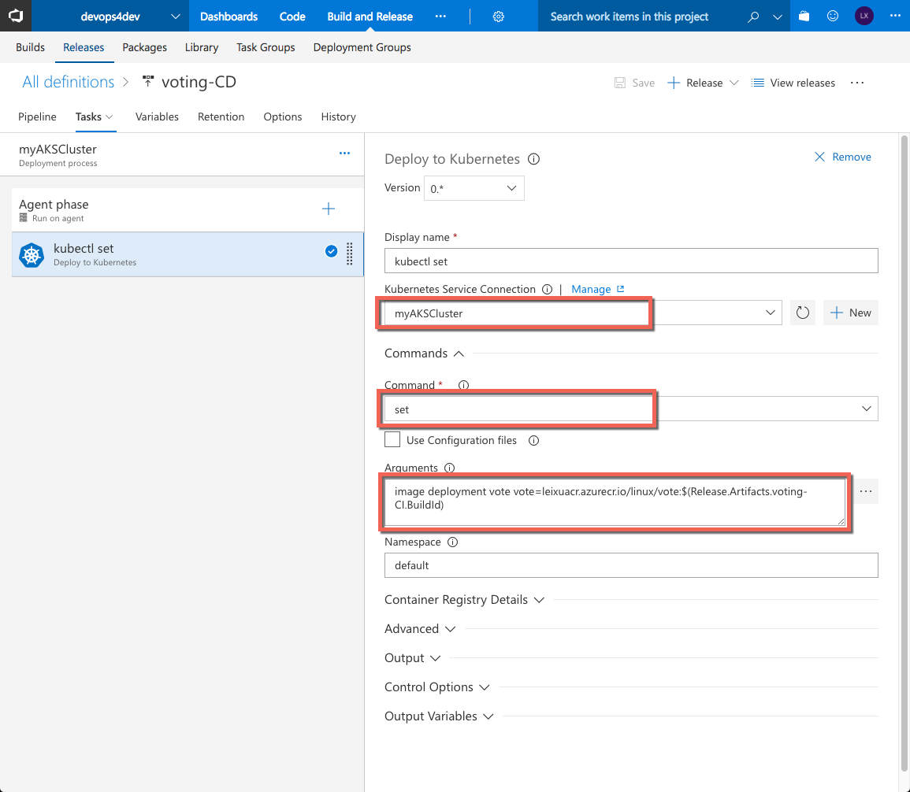

Basically this generates the following command

```bash
kubectl image deployment vote vote=leixuacr.azurecr.io/linux/vote:$(Release.Artifacts.voting-CI.BuildId)
```

> Note: (Release.Artifacts.voting-CI.BuildId) will be the artifact BuildID that triggers this release, which is the same version that has been built in the CI. This make sure AKS is updated with the correct image tag.

To be next time ...